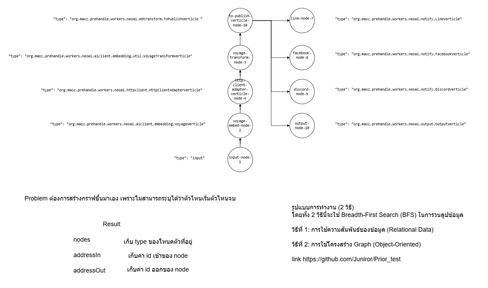

# JSON Graph to Array Index Base

โปรเจกต์สำหรับแปลงข้อมูลกราฟ (Graph) จากรูปแบบ JSON ให้ผลลัพธ์ออกมาเป็น Array Index Base

**ข้อมูลที่ใช้:** ข้อมูล Input นำมาจาก Web API `https://storage.googleapis.com/maoz-event/rawdata.txt`  
**Library ที่ใช้:** ใช้ `Gson` ในการคลาย (Convert) ข้อมูล JSON ให้ออกมาเป็น Data Object

## รูปแบบการทำงาน (2 วิธี)
โดยทั้ง 2 วิธีนี้จะใช้ Breadth-First Search (BFS) ในการวนลูปข้อมูล

### วิธีที่ 1: การใช้ความสัมพันธ์ของข้อมูล (Relational Data)
เราสร้างความสัมพันธ์ของข้อมูลขาเข้าและขาออกสลับกัน เพื่อใช้ในการสืบหาโหนดเริ่มต้น (Root) จากนั้นจึงทำการวนลูป BFS ผ่าน List ชุดนั้น

### วิธีที่ 2: การใช้โครงสร้าง Graph (Object-Oriented)
เราจะนำข้อมูล Data Object ที่ได้ไปสร้างเป็นโครงสร้าง `Graph` และ `Node` ขึ้นมาเป็นตัวกลาง เพื่อให้ข้อมูลมีรูปร่างที่จับต้องได้ง่ายและโยงเส้นทาง (Edges) เข้าหากัน จากนั้นจึงใช้ BFS ในการรับและส่งผ่านข้อมูลตามปกติตามเส้นทางจริง